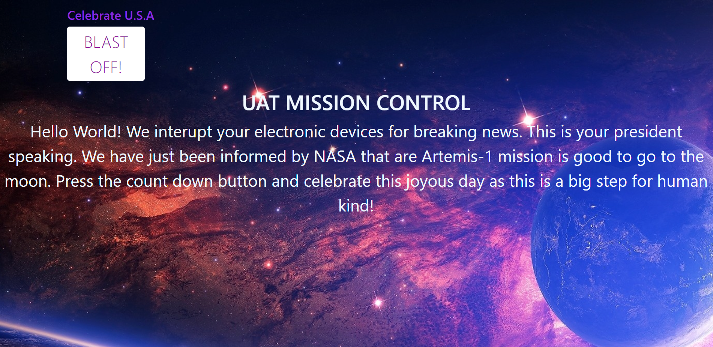

You are a programmer for the UAT Space Program.  It is your duty to create the launch sequence for takeoff.  To do this, you will need to create a JavaScript program that counts from 50 to 0 in 5-second increments and then sends an alert that says “Blastoff!

# REQUIREMENTS

 >👨🏿‍⚖️ Click name to downlaod

[Visual Code](https://code.visualstudio.com/download)

# INSTALLATION

>👨🏿‍⚖️ INSTALL ZIP FILE OR CLONE REPO

[click here](https://github.com/brprod8/Blast-Off/archive/refs/heads/main.zip) for zip file

[click here](https://github.com/brprod8/Blast-Off) to clone repo

# LICENSE
**Open to Experiment**

BY:ROBERT SMITH

CREDIT: University of Advancing Tech

EMAIL - Buildingreality@skiff.com for Colloboration 